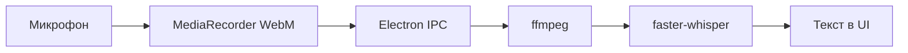
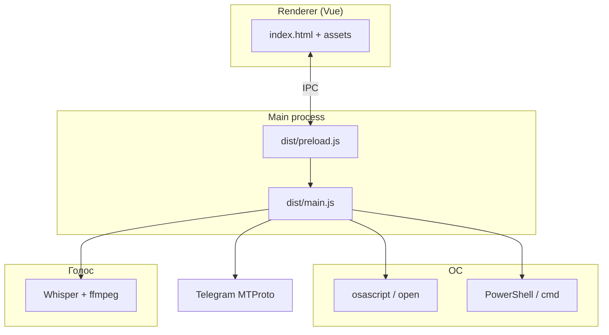

<div align="center">

# Nexa Assistant

**Локальный голосовой AI-ассистент для macOS, Windows и Linux**

Чат, команды, управление системой и браузером, Telegram MTProto — без облака в ядре приложения.

<br/>

[](https://www.electronjs.org/)
[](https://vuejs.org/)
[](https://nodejs.org/)
[]()
[]()
[](https://t.me/Nexa_Assistant)

[macOS](#-установка-macos) ·
[Windows](#-установка-windows) ·
[Linux](#-установка-linux) ·
[Проблемы](#-решение-проблем) ·
[Возможности](#-возможности) ·
[Сборка](#-сборка-установщика) ·
[Telegram @Nexa_Assistant](https://t.me/Nexa_Assistant) ·
[Лицензия](LICENSE.txt)

</div>

---

## О проекте

**Nexa** — десктопное приложение на **Electron** и **Vue**: ассистент работает на вашем компьютере, распознаёт речь через **Whisper** (`faster-whisper`), выполняет системные сценарии и интегрируется с **Telegram** (MTProto). Обновления доставляются через **GitHub Releases** (`electron-updater`).

Новости и обсуждения: [Telegram-канал @Nexa_Assistant](https://t.me/Nexa_Assistant)

> Подходит для разработки, форков и сборки своего билда. Голосовой движок и модели скачиваются при первой настройке — репозиторий остаётся компактным.

---

## Возможности

| | |
|---|---|
| 🎙️ **Голос** | Push-to-talk, локальный Whisper, конвертация WebM → WAV через ffmpeg |
| 💬 **Чат и команды** | Текстовый интерфейс и выполнение сценариев из UI |
| 🖥️ **Система** | Громкость, **запуск любых приложений по имени** (без команд), окна, мышь/клавиатура |
| 📂 **Умный запуск** | Отдельные модули: `apps-darwin.js`, `apps-win32.js`, `apps-linux.js` |
| 🌐 **Браузер** | Открытие URL, вкладки, поиск — Chrome, Edge, Firefox и др. |
| ✈️ **Telegram** | Вход по коду, отправка и чтение сообщений через MTProto |
| 🔄 **Обновления** | Проверка и установка релизов с GitHub |
| 🔌 **Плагины** | Каталог `plugins/` под расширения ([гайд](plugins/README.md)) |

---

## Общие требования

| Компонент | Версия |
|-----------|--------|
| **Node.js** | 18 или новее ([nodejs.org](https://nodejs.org/)) |
| **npm** | 9+ (идёт с Node.js) |
| **Python** | 3.9+ — только для голоса (Whisper) |
| **ffmpeg** | для конвертации записи с микрофона |

> Скачивайте проект через **`git clone`**, а не старый ZIP с GitHub, если в архиве нет скрипта `setup:voice` (см. [решение проблем](#-решение-проблем)).

### Клонирование (все ОС)

```bash
git clone https://github.com/whydarcy/nexa_assistant.git
cd nexa_assistant
```

Проверьте, что вы в **корне** репозитория (рядом должны быть `package.json`, папки `dist/`, `scripts/`, `renderer/`).

```bash
npm install
```

Если есть папка `vue/` (исходники UI):

```bash
npm install --prefix vue
```

Сборка установщика для запуска из исходников **не нужна** — используются готовые `dist/` и `renderer/`.

---

## Установка: macOS

### 1. Системные зависимости

```bash
# Homebrew (если ещё нет): https://brew.sh
brew install ffmpeg
```

Python 3.9+ обычно уже есть; проверка:

```bash
python3 --version
```

### 2. Зависимости проекта

```bash
cd nexa_assistant
npm install
```

### 3. Голос (один раз)

```bash
npm run setup:voice
```

Создаёт `resources/whisper/.venv` и ставит `faster-whisper`.

### 4. Запуск

```bash
npm start
```

В **Cursor / VS Code**, если задана переменная `ELECTRON_RUN_AS_NODE`:

```bash
npm run start:mac
```

### 5. Сборка DMG (опционально)

```bash
npm run dist:mac
```

Результат в папке `release/`.

---

## Установка: Windows

### 1. Системные зависимости

Установите в PowerShell **от имени пользователя** (или через «Установка приложений»):

```powershell
# Node.js LTS — если ещё нет
winget install OpenJS.NodeJS.LTS

# Python (галочка "Add python.exe to PATH" обязательна!)
winget install Python.Python.3.12

# ffmpeg для микрофона
winget install Gyan.FFmpeg
```

Перезапустите терминал после установки. Проверка:

```powershell
node -v
npm -v
python --version
ffmpeg -version
```

### 2. Клонирование и npm

```powershell
cd C:\Users\ВАШ_ПОЛЬЗОВАТЕЛЬ\Projects
git clone https://github.com/whydarcy/nexa_assistant.git
cd nexa_assistant
npm install
```

**Важно:** дождитесь окончания `npm install` без ошибок. Должен появиться файл:

```powershell
dir node_modules\electron\dist\electron.exe
```

Если файла **нет** — см. [Windows: ошибка Electron](#windows-ошибка-electron-getelectronpath).

Проверка скриптов npm:

```powershell
npm run
```

В списке должен быть **`setup:voice`**. Если его нет — у вас старая копия проекта, обновите репозиторий (`git pull`) или клонируйте заново.

### 3. Голос (один раз)

```powershell
npm run setup:voice
```

На Windows используется Python из `resources\whisper\.venv` (как на macOS).

### 4. Запуск

```powershell
npm start
```

### 5. Сборка установщика (опционально)

```powershell
npm run dist:win
```

NSIS-установщик появится в `release\`.

---

## Установка: Linux

### 1. Системные зависимости

**Debian / Ubuntu:**

```bash
sudo apt update
sudo apt install -y nodejs npm python3 python3-venv python3-pip ffmpeg \
  wmctrl xdotool
```

**Fedora:**

```bash
sudo dnf install -y nodejs npm python3 python3-pip ffmpeg wmctrl xdotool
```

**Arch:**

```bash
sudo pacman -S nodejs npm python python-pip ffmpeg wmctrl xdotool
```

`wmctrl` и `xdotool` нужны для управления окнами и вводом с клавиатуры.

### 2. Зависимости проекта

```bash
git clone https://github.com/whydarcy/nexa_assistant.git
cd nexa_assistant
npm install
```

### 3. Голос (один раз)

```bash
npm run setup:voice
```

### 4. Запуск

```bash
npm start
```

### 5. Сборка (опционально)

```bash
npm run dist:linux
```

AppImage и `.deb` — в `release/`.

---

## Решение проблем

### `Missing script: "setup:voice"`

Скрипт есть только в **актуальной** версии репозитория.

1. Убедитесь, что вы в корне проекта: есть файл `scripts/setup-voice.js`.
2. В `package.json` в секции `"scripts"` должна быть строка:
   ```json
   "setup:voice": "node scripts/setup-voice.js"
   ```
3. Обновите код:
   ```bash
   git pull
   ```
   или клонируйте репозиторий заново.

Не используйте устаревший ZIP `Nexa-AI-Assistant-main`, если в нём нет этого скрипта.

### Windows: ошибка Electron (`getElectronPath`)

Означает, что **бинарник Electron не скачался** при `npm install`.

```powershell
cd путь\к\nexa_assistant
Remove-Item -Recurse -Force node_modules -ErrorAction SilentlyContinue
Remove-Item -Force package-lock.json -ErrorAction SilentlyContinue
npm install
dir node_modules\electron\dist\electron.exe
```

Если снова нет `electron.exe`:

- отключите VPN/прокси или задайте зеркало:
  ```powershell
  $env:ELECTRON_MIRROR="https://npmmirror.com/mirrors/electron/"
  npm install
  ```
- проверьте антивирус (не блокирует ли загрузку из GitHub);
- установите Electron явно:
  ```powershell
  npm install electron@28.3.3 --save-dev
  ```

### Голос не работает

```bash
npm run setup:voice
```

| ОС | ffmpeg |
|----|--------|
| macOS | `brew install ffmpeg` |
| Windows | `winget install Gyan.FFmpeg` |
| Linux | `sudo apt install ffmpeg` |

Подробнее: [`resources/ffmpeg/README.md`](resources/ffmpeg/README.md)

### Linux: «функция недоступна» для окон

Установите:

```bash
sudo apt install wmctrl xdotool
```

### macOS: окно не открывается из Cursor

```bash
npm run start:mac
```

---

## Краткая шпаргалка

| Шаг | macOS | Windows | Linux |
|-----|-------|---------|-------|
| Зависимости ОС | `brew install ffmpeg` | `winget` Node, Python, FFmpeg | `apt`/`dnf` node, python, ffmpeg, wmctrl |
| Проект | `npm install` | `npm install` | `npm install` |
| Голос | `npm run setup:voice` | `npm run setup:voice` | `npm run setup:voice` |
| Запуск | `npm start` / `start:mac` | `npm start` | `npm start` |

---

## Распознавание голоса

Скрипт `npm run setup:voice` создаёт виртуальное окружение в `resources/whisper/.venv` и ставит `faster-whisper`.

| ОС | Рантайм |
|----|---------|
| **macOS** | Python + `whisper_recognition.py` |
| **Windows** | Собранный `whisper_recognition.exe` **или** Python из venv |
| **Linux** | Python + `whisper_recognition.py` (как на macOS) |



---

## Сборка установщика

```bash
npm run build    # Vue UI, если есть vue/; иначе — готовый renderer/
```

| Команда | Результат |
|---------|-----------|
| `npm run dist:mac` | DMG / ZIP для macOS |
| `npm run dist:win` | NSIS-установщик Windows x64 |
| `npm run dist:linux` | AppImage и deb для Linux |
| `npm run dist` | win + mac + linux (собирайте на нужной ОС или в CI) |

Публикация в GitHub Releases:

```bash
export GH_TOKEN=ghp_xxxxxxxx   # macOS / Linux
npm run dist:publish
```

```powershell
$env:GH_TOKEN="ghp_xxxxxxxx"     # Windows
npm run dist:publish
```

Токен нужен с правами на создание релизов в [`whydarcy/nexa_assistant`](https://github.com/whydarcy/nexa_assistant).

---

## Скрипты npm

| Скрипт | Описание |
|--------|----------|
| `npm start` | Запуск Electron |
| `npm run start:mac` | Запуск без `ELECTRON_RUN_AS_NODE` |
| `npm run setup:voice` | Настройка Whisper (все ОС) |
| `npm run dist:linux` | Установщик Linux |
| `npm run build` | Сборка Vue → `renderer/` |
| `npm run dist:mac` | Установщик macOS |
| `npm run dist:win` | Установщик Windows |

---

## Структура проекта

```text
nexa_assistant/
├── dist/                    # Main / preload (Electron)
│   └── platform/            # darwin.js | win32.js | linux.js (+ audio/browser/windows/input)
├── renderer/                # Собранный Vue UI
├── vue/                     # Исходники UI (опционально)
├── resources/
│   ├── whisper/             # faster-whisper, Python / .exe
│   ├── ffmpeg/              # Локальный ffmpeg (опционально)
│   └── vosk/                # Резервные speech-модели
├── plugins/                 # Расширения
├── services/nexa/           # Внешний Nexa Access API (опционально)
├── scripts/                 # setup-voice, build-renderer
└── build/                   # Иконки для electron-builder
```

---

## Архитектура



---

## Участие в разработке

1. Форкните репозиторий.
2. Создайте ветку: `git checkout -b feature/my-feature`
3. Закоммитьте изменения и откройте Pull Request.

Идеи и баги — через [Issues](https://github.com/whydarcy/nexa_assistant/issues).

<details>
<summary><strong>Разработчикам: TypeScript и UI</strong></summary>

- Исходники main/preload планируются в `src/` (`tsconfig.json` уже настроен).
- Сейчас в репозитории — скомпилированные `dist/*.js` и готовый `renderer/`.
- После добавления `vue/` пересоберите UI: `npm run build`.

</details>

---

## Лицензия

Использование регулируется [LICENSE.txt](LICENSE.txt). Устанавливая или запуская Nexa, вы принимаете условия соглашения.

---

<div align="center">

**Nexa Assistant** — голосовой помощник на вашем компьютере.

[Telegram @Nexa_Assistant](https://t.me/Nexa_Assistant) · [⬆ Наверх](#nexa-assistant)

</div>
