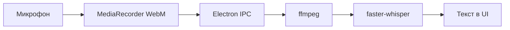
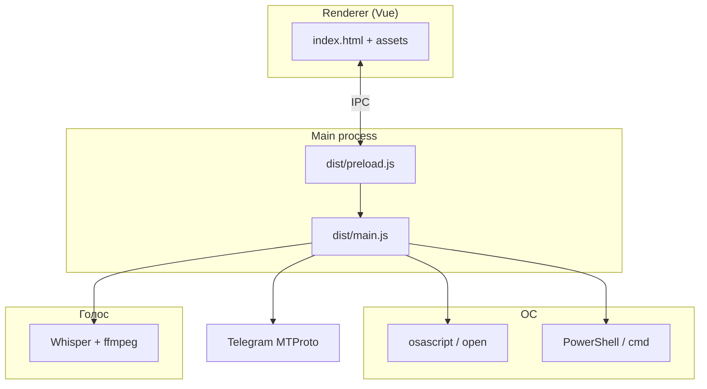

<div align="center">

# Nexa Assistant

**Локальный голосовой AI-ассистент для macOS, Windows и Linux**

Чат, команды, управление системой и браузером, Telegram MTProto — без облака в ядре приложения.

<br/>

[](https://www.electronjs.org/)
[](https://vuejs.org/)
[](https://nodejs.org/)
[]()
[]()
[](https://t.me/Nexa_Assistant)

[Быстрый старт](#-быстрый-старт) ·
[Возможности](#-возможности) ·
[Голос](#-распознавание-голоса) ·
[Сборка](#-сборка-установщика) ·
[Структура](#-структура-проекта) ·
[Telegram @Nexa_Assistant](https://t.me/Nexa_Assistant) ·
[Лицензия](LICENSE.txt)

</div>

---

## О проекте

**Nexa** — десктопное приложение на **Electron** и **Vue**: ассистент работает на вашем компьютере, распознаёт речь через **Whisper** (`faster-whisper`), выполняет системные сценарии и интегрируется с **Telegram** (MTProto). Обновления доставляются через **GitHub Releases** (`electron-updater`).

Новости и обсуждения: [Telegram-канал @Nexa_Assistant](https://t.me/Nexa_Assistant)

> Подходит для разработки, форков и сборки своего билда. Голосовой движок и модели скачиваются при первой настройке — репозиторий остаётся компактным.

---

## Возможности

| | |
|---|---|
| 🎙️ **Голос** | Push-to-talk, локальный Whisper, конвертация WebM → WAV через ffmpeg |
| 💬 **Чат и команды** | Текстовый интерфейс и выполнение сценариев из UI |
| 🖥️ **Система** | Громкость, **запуск любых приложений по имени** (без команд), окна, мышь/клавиатура |
| 📂 **Умный запуск** | Отдельные модули: `apps-darwin.js`, `apps-win32.js`, `apps-linux.js` |
| 🌐 **Браузер** | Открытие URL, вкладки, поиск — Chrome, Edge, Firefox и др. |
| ✈️ **Telegram** | Вход по коду, отправка и чтение сообщений через MTProto |
| 🔄 **Обновления** | Проверка и установка релизов с GitHub |
| 🔌 **Плагины** | Каталог `plugins/` под расширения ([гайд](plugins/README.md)) |

---

## Быстрый старт

### Требования

- **Node.js** 18+
- **npm** 9+
- Для голоса: **Python 3.9+** и **ffmpeg** ([инструкция](resources/ffmpeg/README.md))

### 1. Клонирование и зависимости

```bash
git clone https://github.com/whydarcy/nexa_assistant.git
cd nexa_assistant
npm install
```

Если в репозитории есть папка `vue/` (исходники интерфейса):

```bash
npm install --prefix vue
```

### 2. Запуск без сборки

| macOS | Windows | Linux |
|-------|---------|-------|
| `npm start` или `npm run start:mac` в Cursor | `npm start` | `npm start` |

```bash
# macOS (если ELECTRON_RUN_AS_NODE в IDE)
npm run start:mac

# Windows / Linux
npm start
```

Сборка установщика **не нужна** — используются готовые `dist/` и `renderer/`.

### 3. Голос (один раз)

```bash
npm run setup:voice
```

| Платформа | ffmpeg |
|-----------|--------|
| **macOS** | `brew install ffmpeg` |
| **Windows** | `winget install Gyan.FFmpeg` |
| **Linux** | `sudo apt install ffmpeg` (или аналог для вашего дистрибутива) |

Подробнее: [`resources/ffmpeg/README.md`](resources/ffmpeg/README.md)

---

## Распознавание голоса

Скрипт `npm run setup:voice` создаёт виртуальное окружение в `resources/whisper/.venv` и ставит `faster-whisper`.

| ОС | Рантайм |
|----|---------|
| **macOS** | Python + `whisper_recognition.py` |
| **Windows** | Собранный `whisper_recognition.exe` **или** Python из venv |
| **Linux** | Python + `whisper_recognition.py` (как на macOS) |



---

## Сборка установщика

```bash
npm run build    # Vue UI, если есть vue/; иначе — готовый renderer/
```

| Команда | Результат |
|---------|-----------|
| `npm run dist:mac` | DMG / ZIP для macOS |
| `npm run dist:win` | NSIS-установщик Windows x64 |
| `npm run dist:linux` | AppImage и deb для Linux |
| `npm run dist` | win + mac + linux (собирайте на нужной ОС или в CI) |

Публикация в GitHub Releases:

```bash
export GH_TOKEN=ghp_xxxxxxxx   # macOS / Linux
npm run dist:publish
```

```powershell
$env:GH_TOKEN="ghp_xxxxxxxx"     # Windows
npm run dist:publish
```

Токен нужен с правами на создание релизов в [`whydarcy/nexa_assistant`](https://github.com/whydarcy/nexa_assistant).

---

## Скрипты npm

| Скрипт | Описание |
|--------|----------|
| `npm start` | Запуск Electron |
| `npm run start:mac` | Запуск без `ELECTRON_RUN_AS_NODE` |
| `npm run setup:voice` | Настройка Whisper (macOS + Windows) |
| `npm run build` | Сборка Vue → `renderer/` |
| `npm run dist:mac` | Установщик macOS |
| `npm run dist:win` | Установщик Windows |

---

## Структура проекта

```text
nexa_assistant/
├── dist/                    # Main / preload (Electron)
│   └── platform/            # darwin.js | win32.js | linux.js (+ audio/browser/windows/input)
├── renderer/                # Собранный Vue UI
├── vue/                     # Исходники UI (опционально)
├── resources/
│   ├── whisper/             # faster-whisper, Python / .exe
│   ├── ffmpeg/              # Локальный ffmpeg (опционально)
│   └── vosk/                # Резервные speech-модели
├── plugins/                 # Расширения
├── services/nexa/           # Внешний Nexa Access API (опционально)
├── scripts/                 # setup-voice, build-renderer
└── build/                   # Иконки для electron-builder
```

---

## Архитектура



---

## Участие в разработке

1. Форкните репозиторий.
2. Создайте ветку: `git checkout -b feature/my-feature`
3. Закоммитьте изменения и откройте Pull Request.

Идеи и баги — через [Issues](https://github.com/whydarcy/nexa_assistant/issues).

<details>
<summary><strong>Разработчикам: TypeScript и UI</strong></summary>

- Исходники main/preload планируются в `src/` (`tsconfig.json` уже настроен).
- Сейчас в репозитории — скомпилированные `dist/*.js` и готовый `renderer/`.
- После добавления `vue/` пересоберите UI: `npm run build`.

</details>

---

## Лицензия

Использование регулируется [LICENSE.txt](LICENSE.txt). Устанавливая или запуская Nexa, вы принимаете условия соглашения.

---

<div align="center">

**Nexa Assistant** — голосовой помощник на вашем компьютере.

[Telegram @Nexa_Assistant](https://t.me/Nexa_Assistant) · [⬆ Наверх](#nexa-assistant)

</div>
